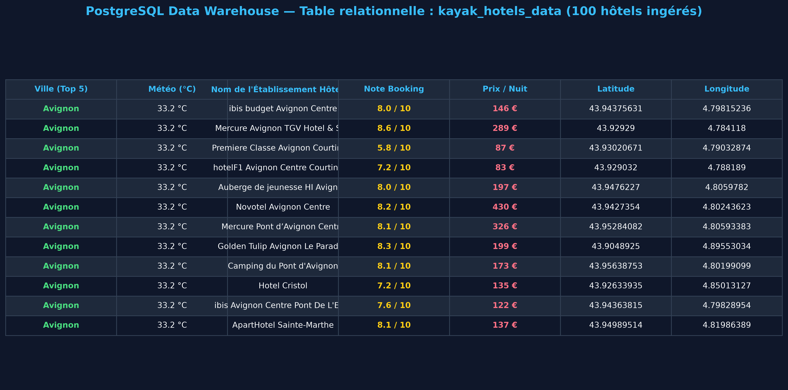
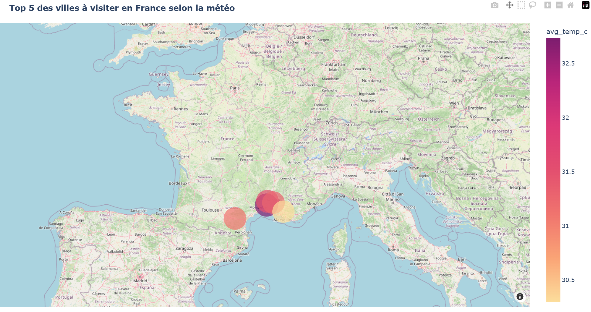
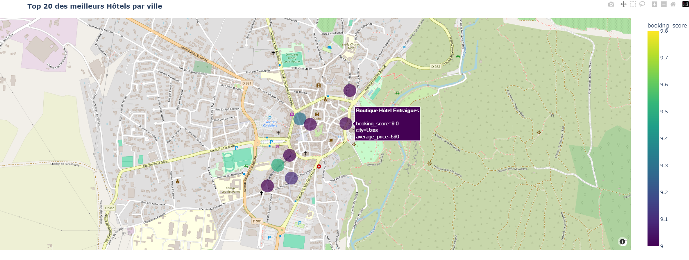

# Bloc 1 — Infrastructure de Données : Kayak Trip Planner

## 🎯 Objectif du Projet
Collecter, transformer et stocker des données météorologiques et hôtelières sur 35 villes de France afin d'aider les utilisateurs à planifier leurs vacances vers les destinations les plus ensoleillées au meilleur prix.

---

## 🛠️ Stack Technique & Architecture
- **Scraping & API :** Scrapy, BeautifulSoup, OpenWeatherMap API (coordonnées GPS et prévisions météo).
- **Data Lake (AWS S3) :** Bucket sécurisé `s3://kayak-trip-planner-chris/` hébergeant les données brutes extraites (fichiers CSV).
- **Data Warehouse (PostgreSQL) :** Base de données relationnelle managée avec table `kayak_hotels_data` (100 hôtels qualifiés, enrichis des scores météo et coordonnées GPS).
- **Data Visualisation :** Folium & Plotly (cartes thermiques et marqueurs enrichis de popups informatives).

---

## 🏗️ Flux de Données & Stockage Cloud

```
[OpenWeatherMap API] ──┐
                       ├──> [ETL Python / Pandas] ──> [AWS S3 Data Lake] ──> [PostgreSQL DWH] ──> [Cartes Folium]
[Booking.com Scraper] ─┘      (Normalisation)           (s3://kayak-...)       (kayak_hotels_data)     (Top 5 / Top 20)
```

### 1. Data Lake S3 (`s3://kayak-trip-planner-chris`)
Les données collectées sont versionnées et stockées sur AWS S3 :
- `kayak/raw_data/booking_hotels.csv` : Dataset complet des hôtels (prix, avis, coordonnées, description).
- `kayak/raw_data/destinations_france_meteo.csv` : Prévisions météo des 35 villes candidates.
- `kayak/raw_data/top_5_destinations.csv` : Top 5 des destinations sélectionnées selon le score d'ensoleillement et de température.

### 2. Aperçu de la Table Data Warehouse (`kayak_hotels_data`)
Les données transformées sont injectées dans la table SQL `kayak_hotels_data` pour être requêtables par les équipes BI et les applications clientes :



*Exemple d'extraction SQL montrant la structure relationnelle : identifiant ville, météo agrégée, nom de l'établissement, note Booking, tarif moyen et géolocalisation.*

---

## 🗺️ Cartographie & Résultats Décisionnels

### Top 5 des Destinations Météo
Identification des villes bénéficiant des conditions météorologiques les plus favorables (ensoleillement et température) :



### Top 20 des Hôtels Recommandés
Cartographie interactive des meilleurs hébergements géolocalisés avec popups détaillées (tarifs et avis clients) :



---

## 📂 Contenu du Répertoire
- `Kayak_trip_planner.ipynb` : Notebook complet d'exploration, appel API météo, calcul des scores et cartographie.
- `Kayak_presentation.pptx` : Support de présentation officiel (soutenance 5 min).
- `data_table_postgresql.png` : Rendu visuel de la table SQL PostgreSQL pour validation de jury.
- `map_top_5_destinations.png` : Rendu cartographique du top 5 météo.
- `map_top_20_hotels.png` : Rendu cartographique du top 20 hôtels avec popups.
- `src/` : Scripts de scraping Booking.com, filtrage météo et ingestion AWS S3 / PostgreSQL.
- `data/` : Datasets nettoyés des hôtels et des prévisions météo.
- `maps/` : Cartes interactives HTML (`top_5_destinations_map.html`, `top_20_hotels_map.html`).
