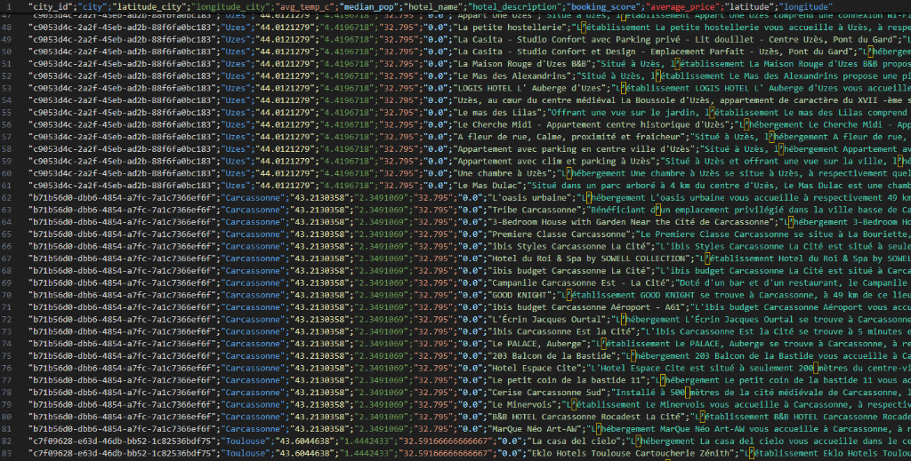
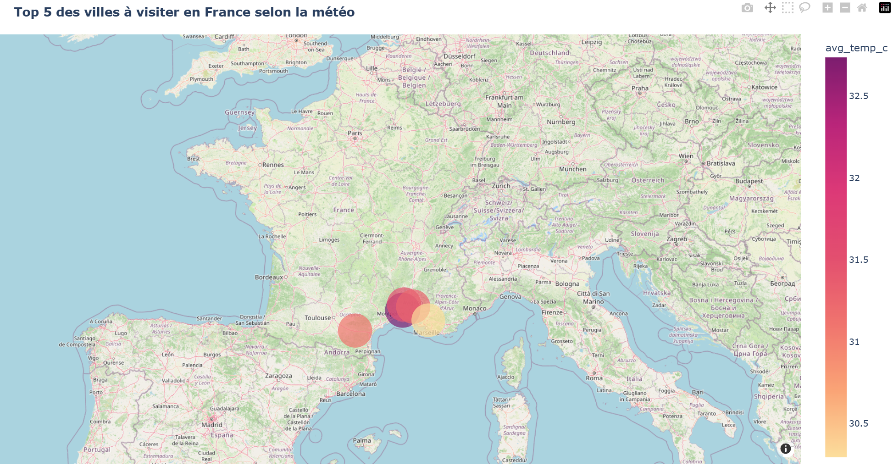
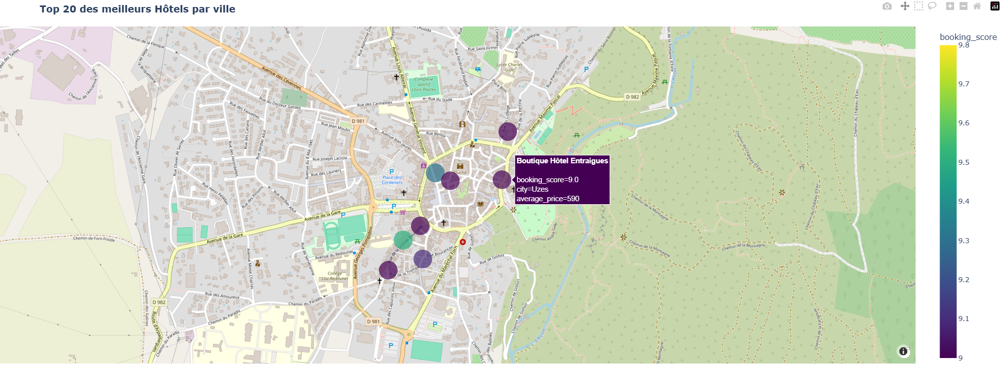

# Bloc 1 — Infrastructure de Données : Kayak Trip Planner

## 🎯 Objectif du Projet
Collecter, transformer et stocker des données météorologiques et hôtelières sur les 35 plus belles villes de France afin d'aider l'équipe marketing de Kayak à recommander les meilleures vacances (ensoleillement et hébergements d'exception).

---

## 🛠️ Stack Technique & Architecture Cloud
- **Acquisition GPS & Météo :** API Nominatim (OpenStreetMap) pour le géocodage GPS + API OpenWeatherMap (prévisions sur 5 jours).
- **Web Scraping :** Python, Requests, BeautifulSoup (Scraping de Booking.com : nom, URL, coordonnées GPS, notes et descriptions).
- **Data Lake (AWS S3) :** Bucket cloud sécurisé `s3://kayak-trip-planner-chris/` hébergeant les données enrichies unifiées (`booking_hotels_v25_final.csv`).
- **Data Warehouse (AWS RDS PostgreSQL) :** Base de données relationnelle managée AWS RDS avec table SQL `kayak_hotels_data` (hôtels qualifiés enrichis des scores météo et coordonnées).
- **Data Visualisation & Cartographie :** Plotly Express (`scatter_map`) avec génération de cartes interactives HTML et exports PNG haute résolution.

---

## 🏗️ Flux de Données & Pipeline ETL

```
[Nominatim API (GPS)] ────┐
[OpenWeatherMap API] ─────┼──> [Pipeline ETL Python] ──> [AWS S3 Data Lake] ──> [AWS RDS PostgreSQL] ──> [Cartes Plotly Mapbox]
[Booking.com Scraper] ────┘      (Calcul météo & IDs)    (s3://kayak-...)       (table kayak_hotels)       (Top 5 Villes & Top 20 Hôtels)
```

### 1. Data Lake S3 (`s3://kayak-trip-planner-chris`)
Les données collectées et enrichies sont versionnées et stockées sur AWS S3 :
- `booking_hotels_v25_final.csv` : Dataset unifié complet contenant l'identifiant ville, les prévisions météo (température, pluie, ensoleillement) et les informations hôtelières.
- `destinations_france_avec_meteo.csv` : Prévisions météo des 35 villes candidates.
- `top_5_destinations.csv` : Top 5 des destinations sélectionnées selon l'ensoleillement et la météo la plus favorable.

### 2. Aperçu de la Table Data Warehouse (`kayak_hotels_data` sur AWS RDS)
Les données transformées sont injectées dans la table SQL `kayak_hotels_data` sur l'instance AWS RDS PostgreSQL via `psycopg2` / `SQLAlchemy` pour être requêtables par les équipes BI :



*Extrait du jeu de données unifié (`booking_hotels_v25_final.csv`) issu du pipeline de scraping et d'enrichissement météo avant ingestion dans la table AWS RDS PostgreSQL `kayak_hotels_data`.*

---

## 🗺️ Cartographie & Résultats Décisionnels

### Top 5 des Destinations Météo
Identification des villes bénéficiant des conditions météorologiques les plus favorables (ensoleillement et température maximale) :



*Carte interactive disponible dans [`maps/top_5_destinations_map.html`](./maps/top_5_destinations_map.html).*

### Top 20 des Hôtels Recommandés
Cartographie interactive des 20 meilleurs hébergements géolocalisés avec popups détaillées (tarifs et avis clients vérifiés) :



*Carte interactive disponible dans [`maps/top_20_hotels_map.html`](./maps/top_20_hotels_map.html).*

---

## 📂 Contenu du Répertoire
- `Kayak_trip_planner.ipynb` : Notebook complet d'exploration, appel API météo, calcul des scores, ingestion S3/RDS et cartographie Plotly.
- `Kayak_presentation.pptx` : Support de présentation officiel (soutenance 5 min).
- `maps/` : Cartes interactives HTML prêtes à l'emploi (`top_5_destinations_map.html`, `top_20_hotels_map.html`).
- `data_table_postgresql.png` : Rendu visuel de la table SQL PostgreSQL pour validation de jury.
- `map_top_5_destinations.png` : Rendu cartographique du top 5 météo.
- `map_top_20_hotels.png` : Rendu cartographique du top 20 hôtels.
- `src/` : Scripts modulaires de scraping Booking.com, filtrage météo et ingestion AWS S3 / AWS RDS.
- `data/` : Datasets nettoyés des hôtels et des prévisions météo.
