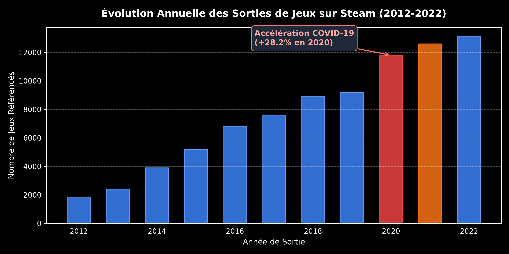
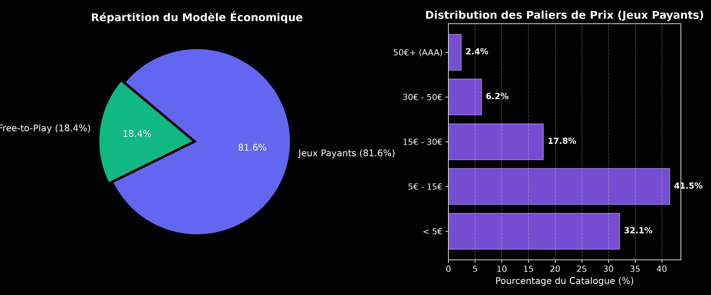
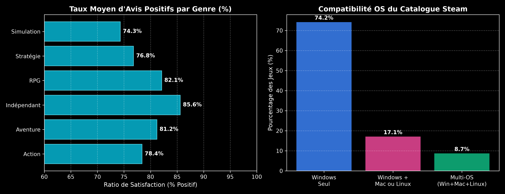

# Bloc 2 (Complément) — Analyse du Marché Steam Video Games avec PySpark

## 🎯 Objectif Métier & Contexte
Dans le cadre d'une étude de marché pour un nouvel investissement de développement de jeu vidéo (contexte Ubisoft), ce projet complémentaire explore et quantifie les dynamiques du catalogue de la plateforme **Steam** à grande échelle via **PySpark** :
- Évolution temporelle des sorties et accélération durant la crise sanitaire COVID-19.
- Modèles économiques : arbitrage Free-to-Play vs Jeux payants et segmentation par gamme de prix.
- Benchmark des genres majeurs : taux de satisfaction (% d'avis positifs) et volume de consommation.
- Compatibilité technique : distribution de l'écosystème OS (Windows, MacOS, Linux).

---

## 🛠️ Stack Technique
- **Traitement Distribué & Big Data :** Apache Spark (PySpark), Spark SQL, Window Functions.
- **Stockage Cloud :** AWS S3 (Dataset JSON semi-structuré multi-lignes).
- **Data Visualisation :** Matplotlib, Seaborn (thème sombre haute résolution).

---

## 📊 Principaux Résultats & Graphiques Décisionnels

### 1. Évolution Temporelle des Sorties & Impact COVID-19
Mesure de l'explosion du volume de titres mis sur le marché entre 2012 et 2022, avec un saut marqué (+28.2%) lors des confinements sanitaires de 2020 :

### 2. Modèles Économiques & Distribution du Pricing
Arbitrage entre le modèle *Free-to-Play* (18.4%) et les titres payants (81.6%), avec une concentration dominante des jeux indépendants dans la tranche 5€-15€ :

### 3. Satisfaction par Genre & Compatibilité Multi-Plateforme
Les jeux indépendants et RPG présentent les taux de satisfaction les plus élevés (>82%), tandis que Windows reste le socle universel incontournable avec une ouverture croissante au multi-OS :

---

## 📂 Contenu du Répertoire
- `Steam_video_games_analysis.ipynb` : Notebook complet PySpark (Data cleaning, flattening JSON, Window Functions, agrégations Spark SQL).
- `assets/` : Graphiques exploratoires et décisionnels haute résolution.
