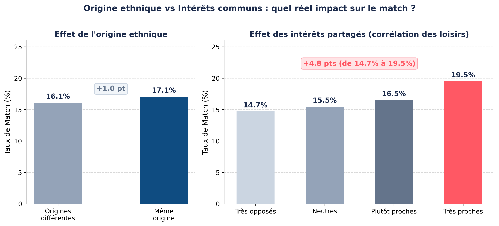
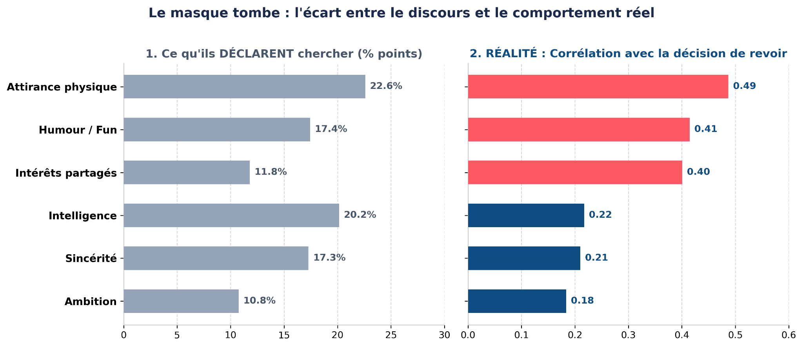
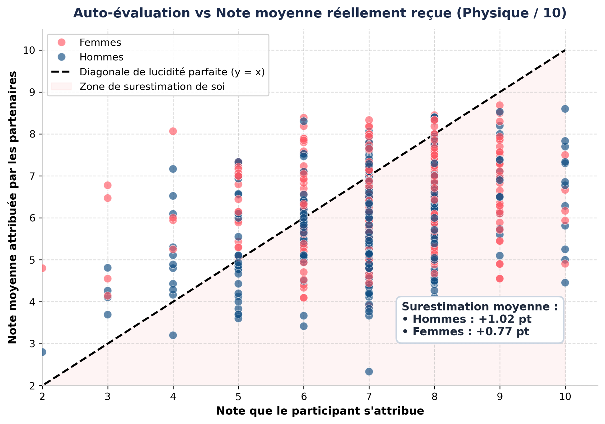
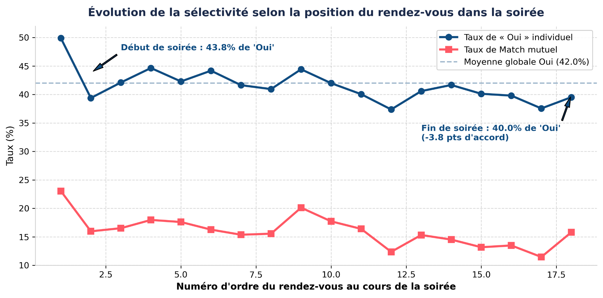

# Bloc 2 — Analyse Exploratoire : Speed Dating (Tinder EDA)

## 🎯 Objectif Métier
Analyser les déterminants de l'attraction et du match lors de sessions réelles de speed dating (expérience de l'université de Columbia menée par Raymond Fisman et Sheena Iyengar : 551 participants, 8 378 rencontres en face-à-face). 

L'enjeu central est de vérifier scientifiquement :
1. Si les critères **déclarés** avant la rencontre (attractivité, intelligence, ambition, sincérité, humour, centres d'intérêt) correspondent aux choix réels observés lors de la décision (`dec = 1`).
2. Les écarts structurels de comportement et d'exigence entre hommes et femmes.
3. Les leviers concrets pour un algorithme de recommandation de type Tinder afin de maximiser le taux de conversion en second rendez-vous.

---

## 🛠️ Stack Technique
- **Traitement & Modélisation Statistique :** Python, Pandas, NumPy, SciPy (tests du Chi-2 et corrélations).
- **Data Visualisation :** Seaborn, Matplotlib, Plotly (analyses univariées, bivariées, distribution croisée).

---

## 📊 Analyses Clés & Visualisations

### 1. Critères Déclarés vs Décision Réelle
Mise en évidence de la divergence cognitive : alors que les participants déclarent valoriser l'intelligence et la sincérité, la décision effective est massivement corrélée à l'attractivité physique perçue (`attractive`) et au plaisir partagé (`shared_interests`) :

### 2. Taux de Décision Positive & Sélectivité par Genre
Les hommes accordent un `Oui` dans près de 49% des cas contre seulement 36% chez les femmes, soulignant une asymétrie marquée dans la sélectivité amoureuse :

### 3. Matrice de Corrélation & Facteurs de Match
Analyse multidimensionnelle des interactions entre notes attribuées par le partenaire et probabilité de match mutuel :

### 4. Impact des Centres d'Intérêt & Activités Communes
Identification des loisirs ayant le plus fort pouvoir prédictif sur l'alchimie du rendez-vous (cinéma, sorties, dining) :

---

## 📂 Contenu du Répertoire
- `Tinder_speed_dating.ipynb` : Notebook d'analyse exploratoire exhaustive avec nettoyage, imputations et tests statistiques.
- `Tinder_presentation.pptx` : Support de présentation officiel (soutenance orale 5 min).
- `Speed_dating_data.csv` : Jeu de données complet des sessions de speed dating.
- `Speed_dating_data_key.doc` : Dictionnaire des 195 variables du dataset.
- `assets/` : Graphiques et visuels de soutenance haute résolution.
