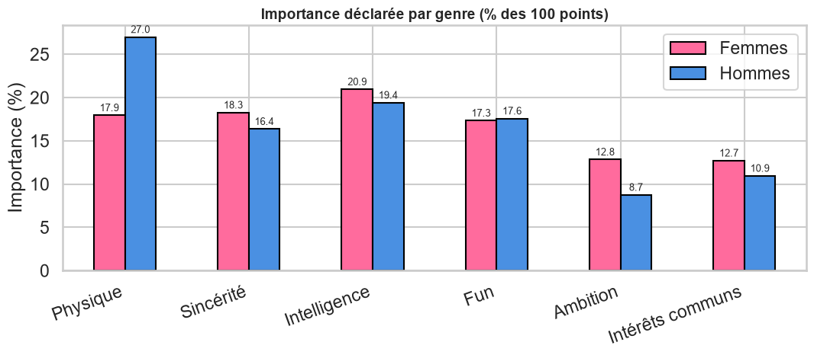
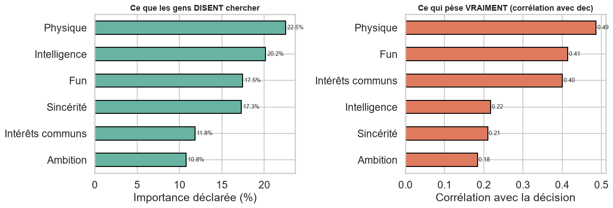
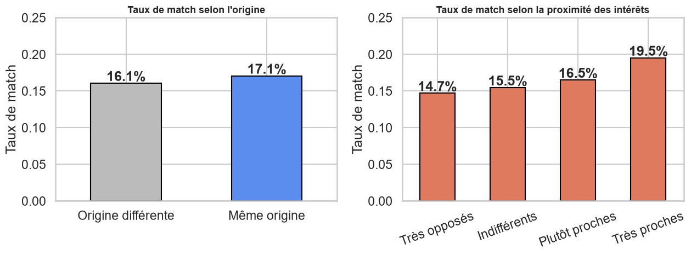
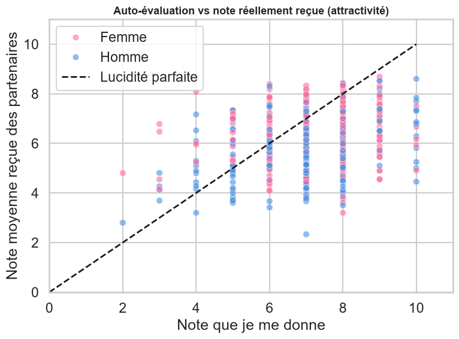
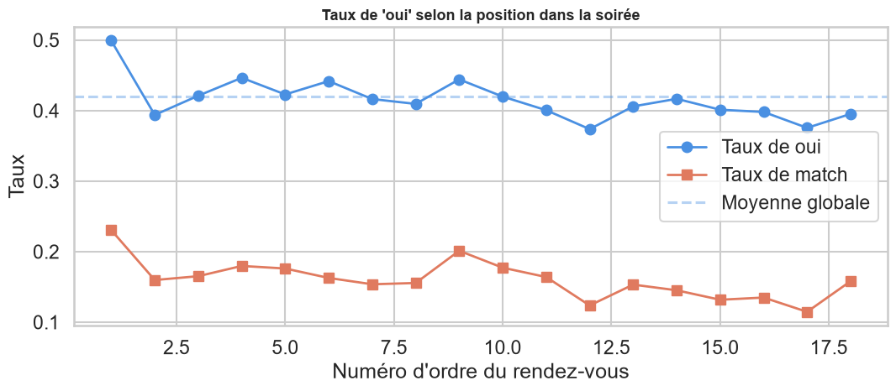

# Bloc 2 — Analyse Exploratoire : Speed Dating (Tinder EDA)

## 🎯 Objectif Métier
Analyser les déterminants de l'attraction et du match lors de sessions réelles de speed dating (expérience de l'université de Columbia menée par Raymond Fisman et Sheena Iyengar : 551 participants, 8 378 rencontres en face-à-face). 

L'enjeu central est de vérifier scientifiquement :
1. Si les critères **déclarés** avant la rencontre (attractivité, intelligence, ambition, sincérité, humour, centres d'intérêt) correspondent aux choix réels observés lors de la décision (`dec = 1`).
2. Les écarts structurels de comportement et d'exigence entre hommes et femmes.
3. Les leviers concrets pour un algorithme de recommandation de type Tinder afin de maximiser le taux de conversion en second rendez-vous.

---

## 🛠️ Stack Technique
- **Traitement Statistique & Exploration :** Python, Pandas, NumPy (statistiques descriptives, normalisation sur 100 points, agrégations bivariées et corrélations linéaires de Pearson).
- **Data Visualisation :** Seaborn, Matplotlib, Plotly (analyses univariées, bivariées, distribution croisée).

---

## 📊 Analyses Clés & Visualisations

### 1. Préférences Déclarées par Genre (Q1)
Sur 100 points à répartir avant les rencontres, les hommes accordent 50 % de plus au physique que les femmes (27,0 % vs 17,9 %). Les femmes privilégient l'intelligence (20,9 %) et la sincérité (18,3 %). Consensus parfait sur l'humour (~17,5 %) :

### 2. Le Choc : Discours Déclaré vs Comportement Réel (Q2)
Mise en évidence du décalage cognitif : alors que l'intelligence et la sincérité sont survalorisées dans les questionnaires, la décision effective (`dec = 1`) est dominée par l'attirance physique ($r = +0,49$), le fun ($r = +0,41$) et les intérêts partagés ($r = +0,40$) :

### 3. Homophilie : Origine Ethnique vs Passions Partagées (Q3)
Partager la même origine ethnique n'apporte qu'un gain marginal non significatif (+1,0 pt de match, 16,1 % → 17,1 %). En revanche, partager de vraies passions communes augmente le taux de match de +4,8 pts (14,7 % → 19,5 %) :

### 4. Biais de Lucidité : Auto-évaluation vs Note Reçue (Q4)
Biais d'optimisme généralisé : la quasi-totalité des participants se surestime par rapport aux notes attribuées par leurs partenaires (+1,02 pt sur 10 chez les hommes, +0,77 pt chez les femmes) :

### 5. Fatigue Décisionnelle : L'Ordre de Passage dans la Soirée (Q5)
Le taux d'acceptation s'érode avec l'accumulation des rencontres, passant de 43,8 % en début de soirée (dates 1–3) à 40,0 % en fin de soirée (dates ≥ 15, soit une baisse de −3,8 pts) :

---

## 📂 Contenu du Répertoire
- `Tinder_speed_dating.ipynb` : Notebook d'analyse exploratoire exhaustive avec nettoyage, imputations et tests statistiques.
- `Tinder_presentation.pptx` : Support de présentation officiel (soutenance orale 5 min).
- `Speed_dating_data.csv` : Jeu de données complet des sessions de speed dating.
- `Speed_dating_data_key.doc` : Dictionnaire des 195 variables du dataset.
- `assets/` : Graphiques et visuels de soutenance haute résolution.
