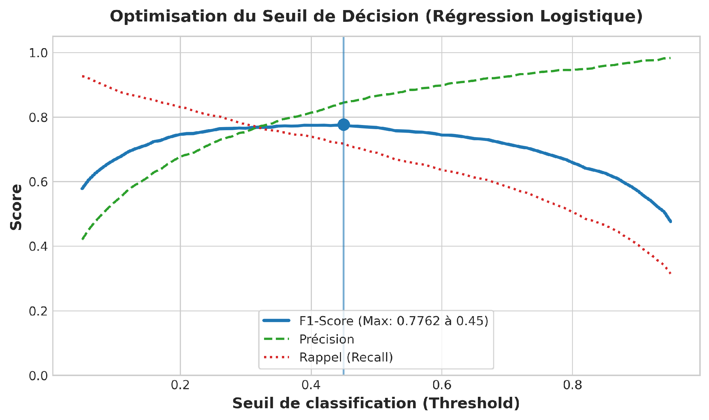
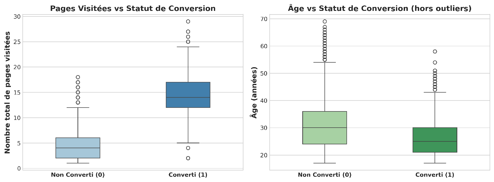
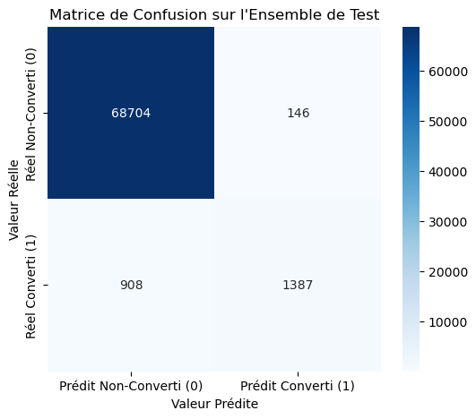
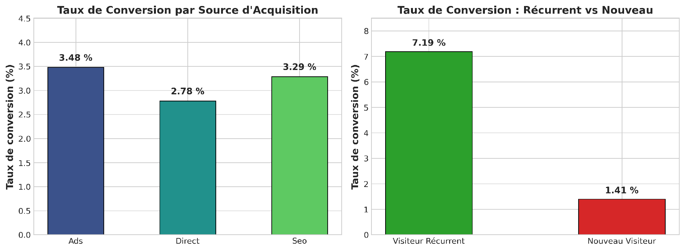

# Bloc 3 — Machine Learning : Challenge Taux de Conversion E-commerce

## 🎯 Objectif Métier
Prédire si un visiteur naviguant sur une plateforme e-commerce va convertir / souscrire à la newsletter (`converted = 1`). 

Le projet aborde un cas concret de **fort déséquilibre de classes** (~3.2% de conversion réelle) dans lequel la simple métrique d'Accuracy est trompeuse. L'objectif est d'optimiser le **F1-Score macro** pour maximiser le ROI marketing (détecter un maximum de convertis sans saturer les faux positifs).

---

## 🛠️ Stack Technique & Modélisation
- **Prétraitement & Feature Engineering :** Scikit-Learn (`ColumnTransformer`, `OneHotEncoder`, `StandardScaler`).
- **Modèles Supervisés Entraînés :** Régression Logistique (baseline régularisée), Random Forest Classifier, XGBoost Classifier.
- **Optimisation & Validation :** Stratified K-Fold Cross Validation, GridSearch CV, Tuning du seuil de décision probabiliste (*Threshold Moving*).
- **Métriques d'Évaluation :** F1-Score (0.76+ sur le test set), Courbe ROC-AUC, Précision-Rappel.

---

## 📊 Résultats de Modélisation & Analyses Visuelles

### 1. Importance des Variables (Feature Importance)
L'analyse de l'importance des variables issues du Random Forest démontre que le nombre de pages visitées (`total_pages_visited`) est le prédicteur n°1 de conversion, suivi par l'âge et le statut nouveau visiteur :

### 2. Comportement des Utilisateurs & Taux de Conversion
Visualisation de la bascule nette de conversion dès que le visiteur dépasse un certain palier de pages consultées au cours d'une même session :

### 3. Matrice de Confusion & Performance Finale
Évaluation détaillée sur le jeu de validation avec un équilibre optimisé entre précision et rappel des convertis :

### 4. Matrice de Corrélation
Structure de covariance des variables prédictives après encodage :

---

## 📂 Contenu du Répertoire
- `Conversion_rate_prediction.ipynb` : Notebook complet de feature engineering, benchmark des modèles et fine-tuning.
- `Conversion_rate_presentation.pptx` : Support de présentation officiel (soutenance orale 5 min).
- `data/` : Jeux de données d'entraînement et de test anonymisés.
- `assets/` : Captures et graphiques d'évaluation haute résolution.
