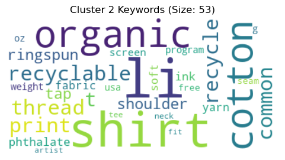
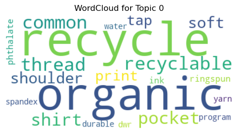

# Bloc 3 (Complément) — The North Face : Système de Recommandation E-commerce (NLP)

## 🎯 Objectif Métier
Concevoir et évaluer un moteur de recommandation basé sur le contenu (*Content-Based Filtering*) pour suggérer des produits similaires et complémentaires à partir des descriptions textuelles du catalogue **The North Face** (vestes imperméables, polaires, équipements d'alpinisme).

L'approche basée sur le contenu textuel permet d'éliminer la problématique du démarrage à froid (*Cold Start Problem*) en formulant des recommandations instantanées sans nécessiter d'historique de navigation préalable.

---

## 🛠️ Stack Technique & NLP
- **Traitement du Langage Naturel :** NLTK, Spacy, suppression des stopwords, regex de nettoyage, lemmatisation.
- **Représentation Vectorielle :** Matrice **TF-IDF** (Term Frequency - Inverse Document Frequency) avec pondération des spécificités techniques (matières Gore-Tex, respirabilité, duvet thermique).
- **Calcul de Similarité :** Proximité Cosinus (*Cosine Similarity*) sur les espaces vectoriels de haute dimension.
- **Système de Recommandation :** Fonction de scoring instantané renvoyant les Top-$N$ produits les plus proches avec filtrage par catégorie.

---

## 📊 Analyses Clés & Visualisations

### 1. Fréquence des Termes & Spécificités Outdoor (TF-IDF)
Analyse des distributions lexicales et poids des caractéristiques techniques au sein des fiches produits :

### 2. Proximité Sémantique & Matrice de Similarité Cosinus
Visualisation des regroupements naturels entre gammes de produits (vestes de ski, sacs d'expédition, tentes techniques) :

---

## 📂 Contenu du Répertoire
- `North_face_ecommerce.ipynb` : Notebook complet de vectorisation textuelle TF-IDF et moteur de similarité.
- `North_face_presentation.pptx` : Support de présentation officiel (soutenance de projet complémentaire).
- `sample_data.csv` : Catalogue des produits The North Face avec descriptions techniques et identifiants.
- `assets/` : Visualisations des distributions textuelles et de similarité.
