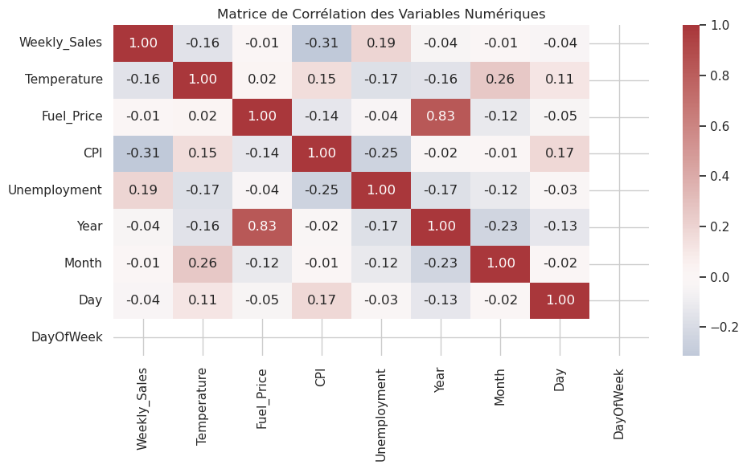
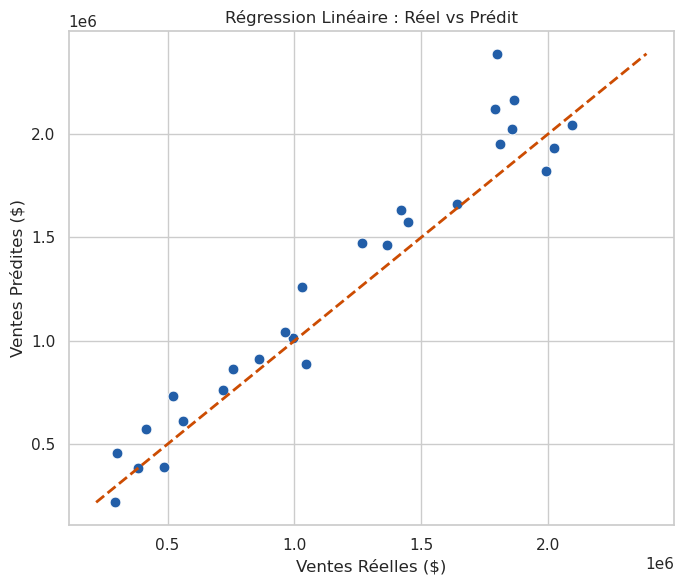
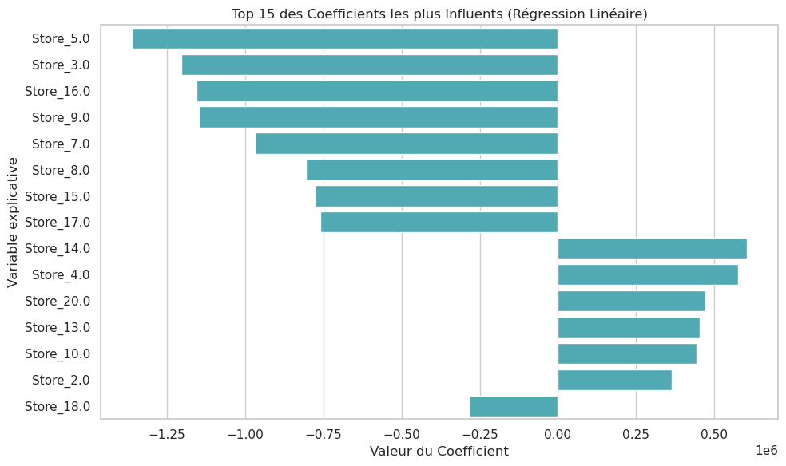

# Bloc 3 (Complément) — Machine Learning : Prédiction des Ventes Walmart

## 🎯 Objectif Métier
Prédire avec précision le chiffre d'affaires hebdomadaire des magasins **Walmart** à partir de variables économiques, calendaires et climatiques (température extérieure, indice des prix à la consommation, taux de chômage local, prix des carburants, semaines fériées).

L'enjeu est de doter les équipes Supply Chain d'un outil prédictif robuste permettant d'anticiper les pics de demande, d'optimiser les stocks et de réduire les coûts logistiques liés aux surstocks ou ruptures.

---

## 🛠️ Stack Technique & Modélisation
- **Prétraitement & Feature Engineering :** Scikit-Learn (`StandardScaler`, `OneHotEncoder`, imputation robuste).
- **Algorithmes Supervisés Évalués :** 
  - Régression Linéaire Multiple (Baseline).
  - Régression **Ridge (L2)** pour stabiliser la colinéarité des indicateurs macroéconomiques.
  - Régression **Lasso (L1)** pour la sélection automatique de variables explicatives.
- **Validation Croisée :** K-Fold Cross-Validation, GridSearchCV pour le réglage optimal du coefficient de pénalité $\alpha$.
- **Performance :** Modèle régularisé atteignant un $R^2 > 0.93$ en validation.

---

## 📊 Analyses Clés & Visualisations

### 1. Structure de Corrélation Macroéconomique
Analyse de l'impact des variables macroéconomiques et des périodes fériées sur le volume des ventes :

### 2. Régularisation & Ajustement des Modèles
Évaluation de l'erreur quadratique moyenne et convergence des coefficients sous contrainte de pénalité :

### 3. Poids des Variables Explicatives (Feature Coefficients)
Identification des facteurs dominants influençant les ventes hebdomadaires (effet d'ancrage du magasin et pics fériés Thanksgiving / Noël) :

---

## 📂 Contenu du Répertoire
- `Walmart_sales_prediction.ipynb` : Notebook complet de feature engineering, benchmark et validation croisée.
- `Walmart_presentation.pptx` : Support de présentation officiel (soutenance de projet complémentaire).
- `Walmart_store_sales.csv` : Jeu de données historique des ventes et indicateurs économiques.
- `assets/` : Graphiques et visualisations d'évaluation du modèle.
