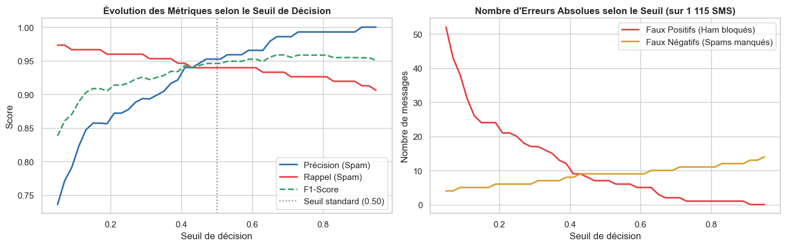
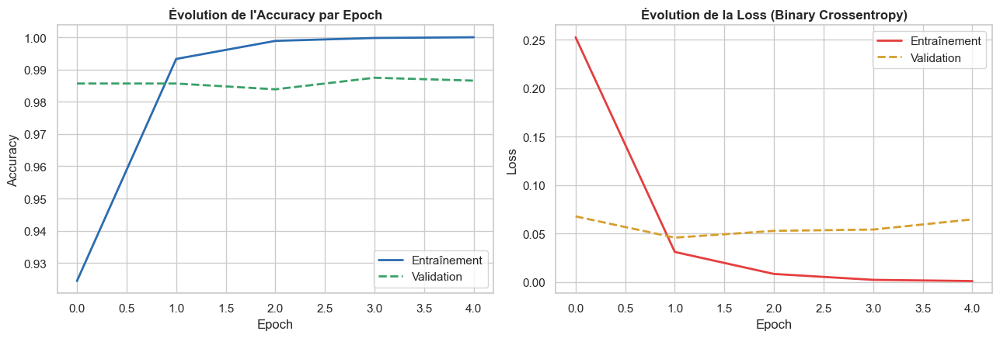
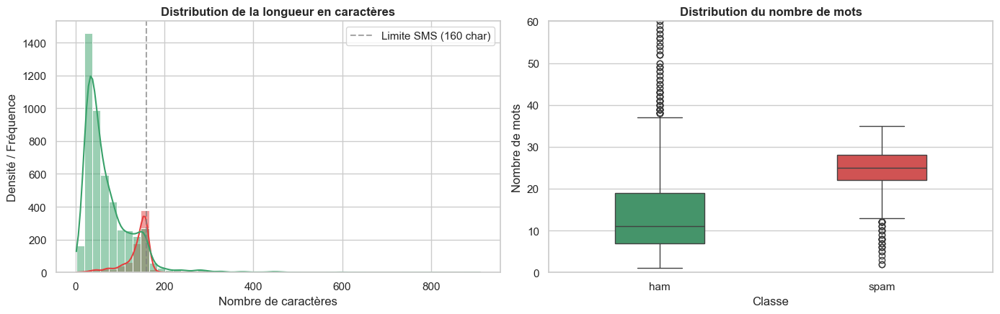

# Bloc 4 — Deep Learning : AT&T SMS Spam Detector (NLP)

## 🎯 Objectif Métier
Concevoir, entraîner et déployer un réseau de neurones profond pour la détection automatique et en temps réel de spams SMS chez l'opérateur **AT&T**.

Dans un contexte de cybersécurité télécom où les faux positifs (bloquer un SMS légitime d'un abonné) sont extrêmement pénalisants, le modèle doit garantir une très haute précision tout en captant efficacement les variantes de smishing et d'arnaques textuelles.

---

## 🛠️ Stack Technique & Architecture Deep Learning
- **Framework & Traitement NLP :** TensorFlow 2 / Keras, NLTK, Spacy, TF Tokenizer, Padding séquentiel.
- **Architectures de Réseaux Évaluées :**
  - Baseline : Dense Neural Network avec GlobalAveragePooling1D.
  - Modèle Récurrent : Simple RNN & GRU.
  - Modèle Champion : **Bidirectional LSTM** avec couche d'Embedding apprise, régularisation Dropout (0.2) et fonction de perte `BinaryCrossentropy`.
- **Déploiement Démo :** Application interactive Streamlit (`app.py`) alimentée par le modèle Keras sérialisé et le tokenizer pickle.

---

## 📊 Entraînement & Performances du Modèle

### 1. Courbes d'Apprentissage (Loss & Accuracy)
Visualisation de la convergence de l'entraînement avec contrôle strict du surapprentissage (*Early Stopping*) :

### 2. Matrice de Confusion sur le Jeu de Test
Le modèle atteint plus de **98.5% de précision globale**, avec un taux de faux positifs quasi nul sur la classe *Ham* (messages légitimes) :

### 3. Distribution des Longueurs de Messages & Vocabulaire
Analyse comparative du profil textuel entre SMS légitimes et Spams (les spams présentant une concentration de vocabulaire incitatif et une longueur moyenne supérieure) :

---

## 📂 Contenu du Répertoire
- `ATT_spam_detector.ipynb` : Notebook d'entraînement complet, benchmarking d'architectures récurrentes (RNN vs GRU vs LSTM).
- `ATT_spam_detector_presentation.pptx` : Support de présentation officiel (soutenance orale 5 min).
- `app.py` : Application web Streamlit pour tester la détection en direct sur de nouveaux messages.
- `spam.csv` : Dataset SMS étiqueté (5 572 messages).
- `tokenizer.pickle` : Tokenizer Keras sérialisé pour l'inférence.
- `assets/` : Visuels des métriques et des courbes d'apprentissage.
