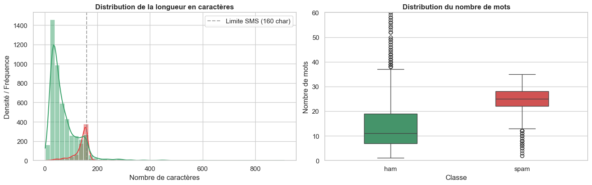
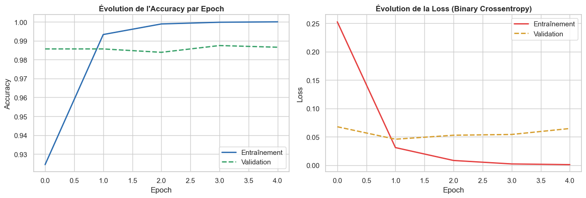
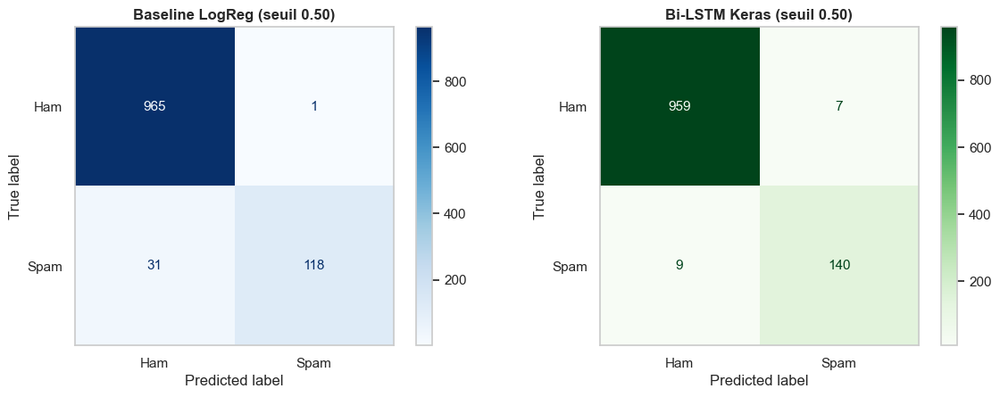
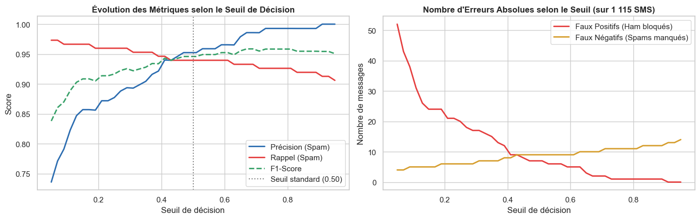

# Bloc 4 — Deep Learning : AT&T SMS Spam Detector (NLP)

## 🎯 Objectif Métier
Concevoir, entraîner et déployer un réseau de neurones profond pour la détection automatique et en temps réel de spams SMS chez l'opérateur **AT&T**.

Dans un contexte de cybersécurité télécom où les faux positifs (bloquer un SMS légitime d'un abonné : code 2FA, urgence médicale) sont inacceptables, le modèle doit concilier une précision chirurgicale, un rappel élevé et une latence d'inférence temps réel ultra-faible (< 5 ms).

---

## 🛠️ Stack Technique & Architecture Deep Learning
- **Framework & Traitement NLP :** TensorFlow 2 / Keras, Scikit-Learn, Pandas, Numpy, Matplotlib, Seaborn.
- **Prétraitement NLP Séquentiel :** Tokenizer Keras (vocabulaire de 10 000 mots les plus fréquents + jeton `<OOV>`), Padding uniforme à 100 tokens.
- **Architectures Évaluées :**
  - **Baseline ML Classique :** Vectorisation TF-IDF (unigrammes + bigrammes, 5 000 features) + Régression Logistique.
  - **Modèle Champion Deep Learning :** Réseau récurrent **Bidirectional LSTM** (338 753 paramètres) :
    1. `Embedding` (10 000 mots $\to$ 32 dimensions denses sémantiques).
    2. `Bidirectional(LSTM(32 units))` (64 descripteurs contextuels gauche $\leftrightarrow$ droite).
    3. `Dense(32, activation='relu')` + `Dropout(0.20)` (régularisation anti-surapprentissage).
    4. `Dense(1, activation='sigmoid')` $\to$ Probabilité $P(\text{Spam}) \in [0, 1]$.
    5. Optimiseur **Adam** ($lr=0,001$), fonction de perte **Binary Crossentropy**, callback **EarlyStopping** (`restore_best_weights=True`).
- **Déploiement Opérationnel :** Application web interactive Streamlit (`app.py`) alimentée par les artefacts sérialisés (`att_spam_model.keras` et `tokenizer.pickle`).

---

## 📊 Benchmark & Performances Comparatives

Évaluation sur le jeu de test indépendant (1 115 SMS : 966 Ham et 149 Spam, split stratifié 80/20) :

| Modèle Évalué | Accuracy | Précision (Spam) | Rappel (Spam) | F1-Score | ROC-AUC | Faux Négatifs (Ratés) | Faux Positifs (Bloqués) |
| :--- | :---: | :---: | :---: | :---: | :---: | :---: | :---: |
| **Baseline (TF-IDF + LogReg)** | 97,22 % | 99,17 % | 79,87 % (119/149) | 0,8848 | 0,9856 | 30 | **1** |
| **Champion Bi-LSTM (Seuil 0,50)** | **98,57 %** | **95,24 %** | **93,96 % (140/149)** | **0,9459** | **0,9925** | **9** (divisé par 3,3 !) | 7 |
| **Bi-LSTM Télécom (Seuil 0,70)** | 98,92 % | 98,58 % | 93,29 % (139/149) | **0,9586** | 0,9925 | 10 | **2** |
| **Bi-LSTM Sécurisé (Seuil 0,90)** | 98,83 % | **100,0 %** | 91,28 % (136/149) | 0,9544 | 0,9925 | 13 | **0 (Zéro FP)** |

---

## 📈 Visualisations & Graphiques Analytiques

### 1. Analyse Exploratoire : Morphologie & Longueur des Textes
Les spams présentent une longueur moyenne double des messages légitimes (139 caractères vs 71 caractères) et sont saturés d'impératifs d'action :

### 2. Suivi de l'Entraînement : Convergence & Early Stopping
Arrêt propre à l'epoch 5 avec restauration des meilleurs poids de l'epoch 2 (`val_loss = 0,045`), évitant toute divergence de surapprentissage :

### 3. Comparaison des Matrices de Confusion (Seuil 0,50)
Le réseau récurrent Bi-LSTM fait passer le nombre de spams manqués de 30 à seulement 9 sur le jeu de test :

### 4. Pilotage du Seuil de Décision selon la Politique Réseau
L'abaissement des faux positifs sans dégradation du rappel guide le choix du seuil opérationnel (0,70 pour l'optimum F1 ou 0,90 pour le zéro FP absolu) :

---

## 📂 Contenu du Répertoire
- `ATT_spam_detector.ipynb` : Notebook d'expérimentation et d'évaluation complète (donnée maître).
- `ATT_spam_detector_presentation.pptx` : Support de présentation officiel (soutenance 5 min chrono).
- `app.py` : Application interactive Streamlit (démonstration jury en direct).
- `spam.csv` : Dataset SMS de référence (5 572 messages).
- `att_spam_model.keras` : Modèle champion Bi-LSTM sérialisé Keras v3.
- `tokenizer.pickle` : Dictionnaire et configuration du Tokenizer Keras.
- `assets/` : Visuels haute fidélité synchronisés avec le notebook.
- `FICHE_REVISION_BLOC_4_ATT_SPAM_RECTO_VERSO.pdf` : Fiche mémo technique A4 recto-verso.
- `ORAL_SOUTENANCE_BLOC_4_ATT_SPAM_SLIDE_PAR_SLIDE.pdf` : Fiche prompteur oral slide par slide.
