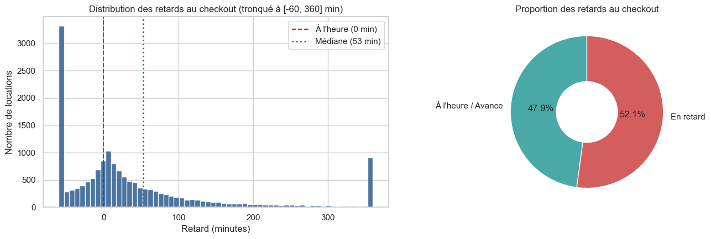
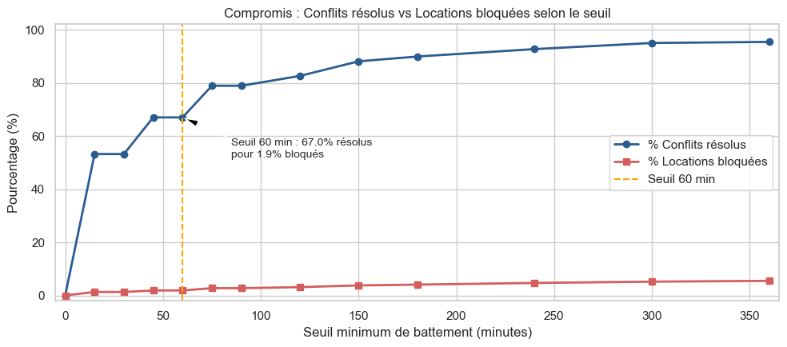
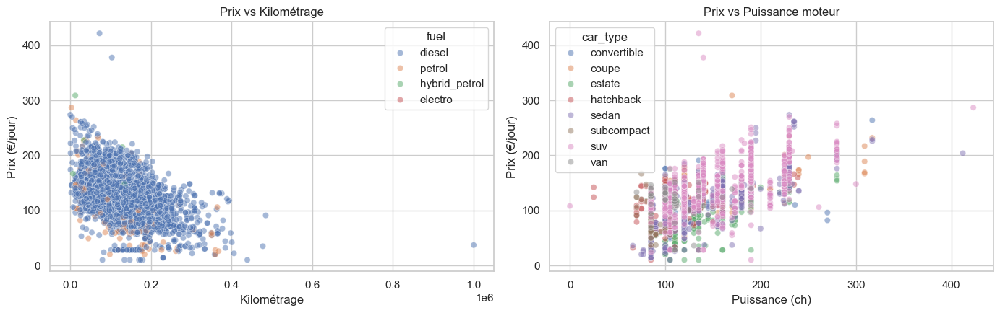

# Bloc 5 — Industrialisation & Déploiement : Getaround Pricing & Delays

## 🎯 Objectif du Projet
Deux volets majeurs pour optimiser la rentabilité et l'expérience utilisateur sur la plateforme Getaround :
1. **Étude décisionnelle des retards :** Dimensionner le seuil optimal de battement (*Threshold delay*) entre locations successives pour minimiser les annulations en cascade sans pénaliser les revenus des propriétaires.
2. **Moteur de tarification en production :** Entraîner un modèle de prédiction du prix de location journalier, le servir via une API REST sécurisée et fournir un dashboard interactif.

---

## 🛠️ Stack Technique & MLOps
- **API Backend :** FastAPI, Pydantic v2, Uvicorn, Swagger UI (`/docs`).
- **Dashboard Web :** Streamlit (analyse interactive de l'impact business des retards).
- **Modélisation & Suivi :** Scikit-Learn (Random Forest Regressor), Joblib, MLflow Tracking & Registry.
- **Conteneurisation & Cloud :** Docker, Docker Compose, Hugging Face Spaces (CI/CD automatisée).

---

## 🌐 Déploiements en Ligne (Hugging Face Spaces)
Les services sont conteneurisés et déployés en production sur l'infrastructure cloud Hugging Face :
- 📊 **Dashboard Décisionnel (Streamlit) :** [https://huggingface.co/spaces/Elkristobal59/getaround-analysis-dashboard](https://huggingface.co/spaces/Elkristobal59/getaround-analysis-dashboard)
- ⚡ **API Inférence & Documentation Swagger UI :** [https://elkristobal59-getaround-pricing-api.hf.space/docs](https://elkristobal59-getaround-pricing-api.hf.space/docs)
  *(Espace Hugging Face de l'API : [Elkristobal59/getaround-pricing-api](https://huggingface.co/spaces/Elkristobal59/getaround-pricing-api))*

---

## 📊 Analyses Décisionnelles & Métriques Business

### 1. Fréquence et Distribution des Retards de Restitution
Près d'une restitution sur trois s'effectue en retard, avec des impacts directs sur les conducteurs suivants dans le cadre de réservations consécutives rapprochées :

### 2. Typologie des Check-in : Connect vs Mobile
Les véhicules équipés du boîtier télématique *Connect* (ouverture par smartphone) affichent une ponctualité significativement supérieure aux remises de clés physiques *Mobile* :

### 3. Simulation du Seuil de Battement (Délai Tampon)
Analyse d'arbitrage (*Trade-off*) entre le volume de locations annulées évitées et le manque à gagner généré par l'indisponibilité du véhicule :

---

## 🔌 Endpoints de l'API en Production
| Méthode | Endpoint | Description |
| :---: | :--- | :--- |
| `GET` | `/` | Healthcheck, statut du service et traçabilité de l'architecture MLOps |
| `GET` | `/info` | Liste des marques/catégories acceptées et métriques de validation ($R^2 = 0.73$, $\text{MAE} = 10.8\ €$) |
| `POST` | `/predict` | Inférence unitaire universelle (schémas Pydantic v2 + format legacy) |
| `POST` | `/predict/batch` | Inférence groupée pour gestionnaires de flotte |
| `GET` | `/docs` | Documentation interactive Swagger UI avec console de test intégrée |

---

## 🚀 Architecture de Déploiement MLOps (Production-Ready)
L'API d'inférence FastAPI (`src/api.py`) est conçue selon les standards industriels MLOps modernes :
1. **Model Registry Centralisé (MLflow) :** Lors de l'entraînement (`src/train.py`), le pipeline de régression Random Forest est loggué et versionné dans MLflow avec ses hyperparamètres et métriques ($R^2 = 0.73$, $\text{MAE} = 10.8\ €$).
2. **Chargement Dynamique à Chaud :** Au boot, l'API interroge la variable `MLFLOW_MODEL_URI` (par défaut `models:/GetAround_Pricing_Model/Production`) pour charger dynamiquement la dernière version validée sans nécessiter de reconstruction de l'image Docker (*Zero-Rebuild Deployment*).
3. **Résilience & Haute Disponibilité :** Si le serveur MLflow distant est indisponible, l'API bascule automatiquement et de manière transparente sur le cache local (`models/model.joblib`), garantissant 100% d'uptime (*Zero-Downtime Fallback*).

---

## 📂 Contenu du Répertoire
- `Getaround_analysis.ipynb` : Notebook d'analyse exploratoire des retards et du pricing.
- `Getaround_presentation.pptx` : Support de présentation officiel (soutenance orale 5 min).
- `src/` : Scripts de l'API FastAPI (`api.py`), du dashboard Streamlit (`dashboard.py`) et d'entraînement (`train.py`).
- `models/` : Cache local haute disponibilité (`model.joblib`).
- `data/` : Jeux de données historiques des retards et des tarifs.
- `docker/` et `docker-compose.yml` : Configuration des conteneurs pour le déploiement local ou cloud.
- `assets/` : Graphiques et visualisations de l'étude d'impact business.
