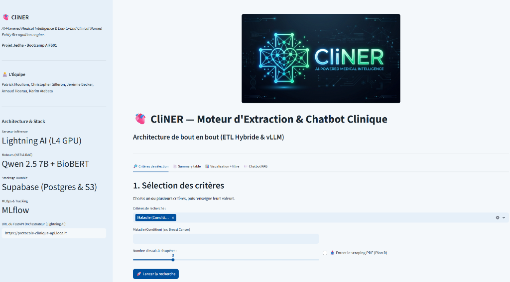
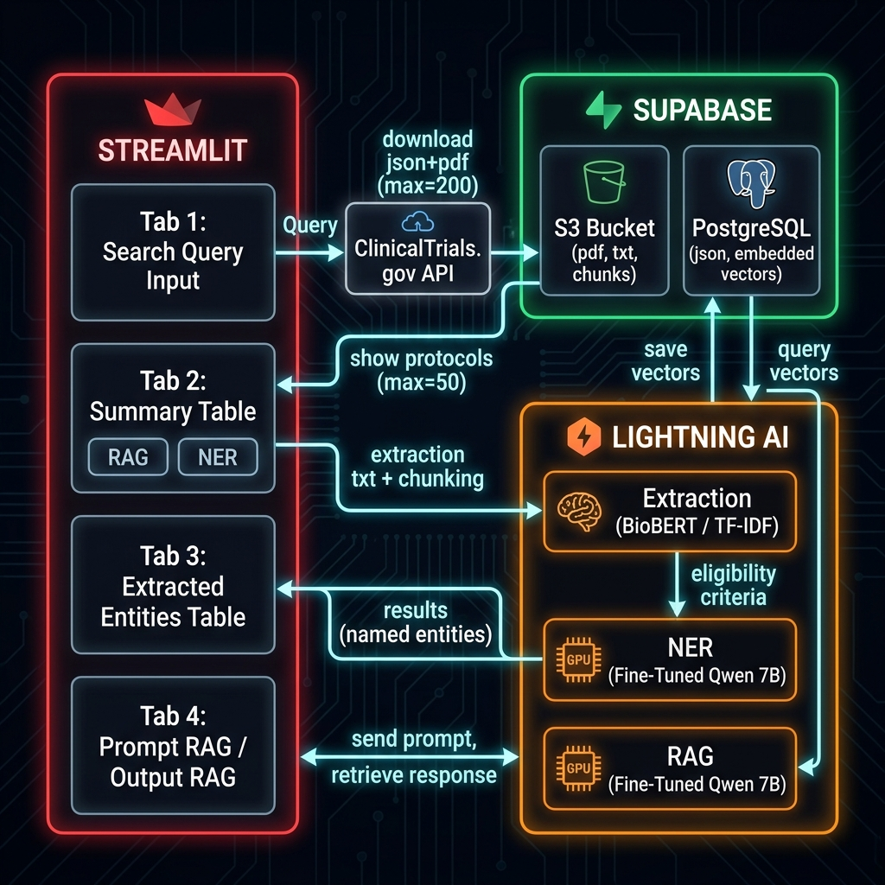

# Bloc 6 — Direction de Projet IA : CliNER (Clinical Trial Eligibility)

## 🎯 Objectif du Projet
**CliNER** est une solution d'IA générative et de traitement du langage naturel (NLP/LLM) dédiée à l'extraction automatique, la structuration et la validation des critères d'éligibilité des essais cliniques (ClinicalTrials.gov). 

Elle résout le problème critique du recrutement des patients en recherche biomédicale, où 86% des essais cliniques subissent des retards majeurs dus à la complexité des critères d'inclusion et d'exclusion.

---

## 🛠️ Stack Technique & Architecture IA
- **Fine-Tuning LLM & NER :** Qwen-2.5-7B fine-tuné avec LoRA (PEFT, 4-bit QLoRA, Chia Corpus) pour l'extraction précise d'entités médicales complexes (Pathologies, Traitements, Biomarqueurs, Valeurs seuils).
- **Embeddings Biomédicaux :** BioBERT / PubMedBERT pour la vectorisation sémantique.
- **Data & Vector Store :** PostgreSQL avec extension `pgvector` (Supabase Cloud).
- **Serving & Déploiement :** FastAPI (inférence asynchrone multimodale), Streamlit (interface utilisateur clinique), Docker Compose.

---

## 🖼️ Architecture & Interface de Démonstration

### 1. Vue d'Ensemble du Pipeline Clinique
Pipeline de bout en bout intégrant l'ingestion ClinicalTrials, l'extraction d'entités par le LLM et la validation sémantique :

### 2. Interface Utilisateur & Dashboard Médical
Interface praticien permettant de soumettre un protocole textuel ou un identifiant NCT pour obtenir l'extraction visuelle et la structuration JSON immédiate :

### 3. Schéma Global de la Plateforme
Organisation des flux d'ingestion, de vectorisation et de serving d'inférence LoRA :

---

## 📂 Contenu du Répertoire
- `CliNER_presentation.pptx` : Support de présentation officiel (soutenance finale 10 min Demoday).
- `app/` : Application Web Streamlit avec surlignage d'entités médicales en direct.
- `api/` : API backend FastAPI exposant les endpoints d'inférence.
- `scripts/` : Scripts de démonstration d'inférence Qwen (`inference_qwen.py`), d'évaluation (`evaluate_ner_brateval.py`) et de scraping en direct.
- `data/` : Échantillons annotés Chia Gold Standard pour la validation de performance.
- `Dockerfile` et `docker-compose.yml` : Configuration des conteneurs pour le déploiement de la solution.
- `assets/` : Schémas d'architecture et visuels de soutenance.
