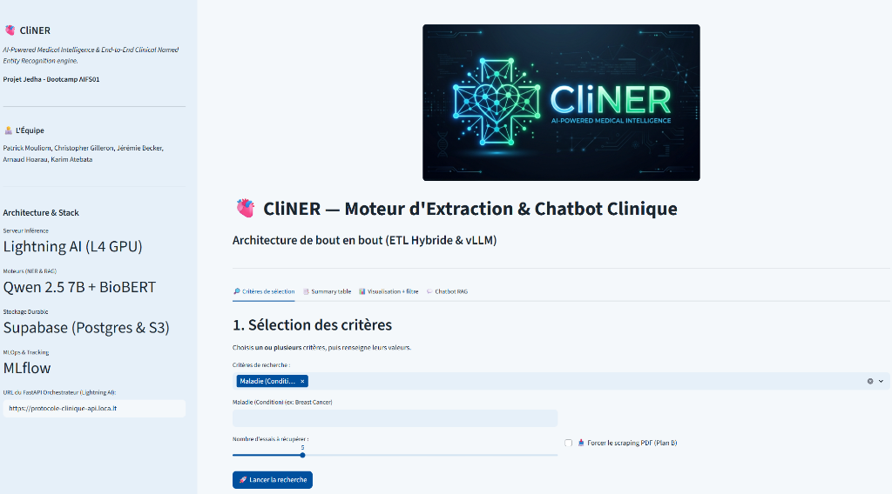
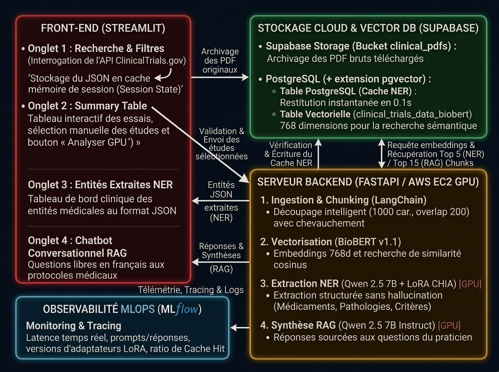

# Bloc 6 — Direction de Projet IA : CliNER (Clinical Trial Eligibility)

## 🎯 Objectif du Projet
**CliNER** (*Clinical Named Entity Recognition*) est une solution d'IA de **Reconnaissance d'Entités Nommées Médicales (Clinical NER)** et de traitement du langage naturel (NLP / Fine-Tuning LLM) dédiée à l'extraction automatique, la structuration et la validation des critères d'éligibilité des essais cliniques ([ClinicalTrials.gov](https://clinicaltrials.gov)). 

Elle résout le problème critique du recrutement des patients en recherche biomédicale, où **86 % des essais cliniques subissent des retards majeurs** dus à la complexité et au manque de structuration des critères d'inclusion et d'exclusion (souvent noyés dans des protocoles PDF de 50 à 100 pages).

---

## 🛠️ Stack Technique & Architecture IA
- **Moteur Clinical NER & Fine-Tuning LLM :** Extraction chirurgicale d'entités médicales complexes (Pathologies, Traitements/Molécules, Biomarqueurs, Mesures seuils, Temporalités) via **Qwen 2.5 7B** fine-tuné avec adaptateur **LoRA** (PEFT, 4-bit QLoRA) sur le corpus Gold Standard médical **CHIA** (1 000 études cliniques).
- **Embeddings Biomédicaux & Reranking :** **BioBERT v1.1** (768 dimensions) pour le chunking dense (512 tokens) et la sélection des Top-5 chunks (NER) / Top-15 chunks (Chatbot).
- **Data & Vector Store Managé :** **PostgreSQL** avec extension vectorielle **`pgvector`** et table de cache persistant `clinical_ner_cache` (hit 0,1s) hébergés sur **Supabase Cloud**, couplés à un stockage objet S3 (`clinical_pdfs`) avec zone de rejet.
- **Serving & Inférence Haute Performance :** **FastAPI** asynchrone propulsé par le moteur **vLLM** (débit ~75 tok/s) sur instance GPU dédiée **AWS EC2 g4dn.xlarge (NVIDIA T4)**.
- **Interface Praticien (Front-End) :** **Streamlit** multi-onglets (Recherche en direct, Table interactive avec cache session RAM, Dashboard visuel avec surlignage couleur des entités NER, Chatbot RAG sourcé) déployé sur **Render** (CI/CD GitHub Auto-Deploy).
- **Observabilité MLOps :** **MLflow Tracking & Model Registry** (suivi de la latence, traces applicatives RAG/NER, versions des adaptateurs LoRA).

---

## 🏛️ Gouvernance, Budget FinOps & Conformité RGPD

### 1. Conformité RGPD & Données de Santé (HDS / PHI-Free)
- **Traitement exclusif de données publiques :** Ingestion stricte des protocoles d'essais cliniques publics (ClinicalTrials.gov, PubMed, corpus CHIA) ne contenant **aucune donnée à caractère personnel nominative de patient (PHI-Free)**.
- **Souveraineté Hospitalière & Herméticité :** Solution intégralement conteneurisée (Docker) conçue pour un déploiement *on-premise* dans l'enclave sécurisée du réseau hospitalier (DMZ CHU). **Zéro fuite de données ou de requêtes médicales vers des tiers ou des API LLM propriétaires**.
- **Auditabilité :** Traçabilité complète des versions de modèles via MLflow Model Registry et journalisation chiffrée des inférences.

### 2. Budget Prévisionnel & Stratégie FinOps
- **Coût d'Entraînement / Fine-Tuning :** **15,20 $** au total (5 heures sur instance cloud GPU NVIDIA A10G spot via QLoRA 4-bit).
- **Coût d'Inférence Opérationnelle :** **0,00 $ pour 40 % des requêtes récurrentes** grâce au cache persistant Supabase (temps de réponse < 0,2s sans solliciter le GPU).
- **Coût d'Infrastructure Serveur :** Instance GPU dédiée à la demande (AWS EC2 g4dn.xlarge à 0,52 $/h ou runtime partagé vLLM), permettant un coût d'exploitation maîtrisé inférieur à **1 200 € / an** pour un service hospitalier.

### 3. Planning Projet & Calendrier de Déploiement (Gantt 6 Mois)
- **Mois 1 - Mois 2 (Cadrage & Ingestion) :** Définition des besoins oncologiques, constitution du Gold Standard CHIA (1 000 études annotées) et pipeline de scraping automatisé ClinicalTrials.gov.
- **Mois 3 - Mois 4 (Modélisation & Fine-Tuning) :** Benchmark comparatif BioBERT vs Qwen 2.5 7B LoRA, calibration des hyperparamètres, et intégration du pipeline vLLM.
- **Mois 5 - Mois 6 (Industrialisation & Pilote) :** Mise en place du monitoring MLflow, conteneurisation Docker Compose, tests d'acceptation utilisateurs (UAT) avec des praticiens et déploiement pilote.

---

## 🖼️ Architecture & Interface de Démonstration

### 1. Vue d'Ensemble du Pipeline Clinique
Pipeline de bout en bout intégrant l'ingestion ClinicalTrials, l'extraction d'entités par le LLM et la validation sémantique :

### 2. Interface Utilisateur & Dashboard Médical
Interface praticien permettant de soumettre un protocole textuel ou un identifiant NCT pour obtenir l'extraction visuelle et la structuration JSON immédiate :

### 3. Schéma Global de la Plateforme (Architecture & Flux de Données)
Organisation complète des flux de données entre l'interface Streamlit, le stockage Supabase Cloud, le serveur d'inférence GPU AWS EC2 (BioBERT + Qwen LoRA) et le suivi MLflow :

---

## 📂 Contenu du Répertoire
- `CliNER_presentation.pptx` : Support de présentation officiel (soutenance finale 10 min Demoday).
- `CliNER_benchmark_evaluation.ipynb` : Notebook d'évaluation comparative rigoureuse (Dictionary Floor vs. Qwen Zero-Shot vs. Qwen 7B LoRA sur CHIA).
- `app/` : Application Web Streamlit avec surlignage d'entités médicales en direct.
- `api/` : API backend FastAPI exposant les endpoints d'inférence (NER & RAG).
- `scripts/` : Scripts d'inférence LoRA (`inference_qwen.py`) et d'ingestion/scraping en direct (`live_scraper.py`).
- `data/` : Échantillons annotés Chia Gold Standard pour la validation de performance.
- `Dockerfile` et `docker-compose.yml` : Configuration des conteneurs pour le déploiement de la solution.
- `assets/` : Schémas d'architecture et visuels de soutenance.
